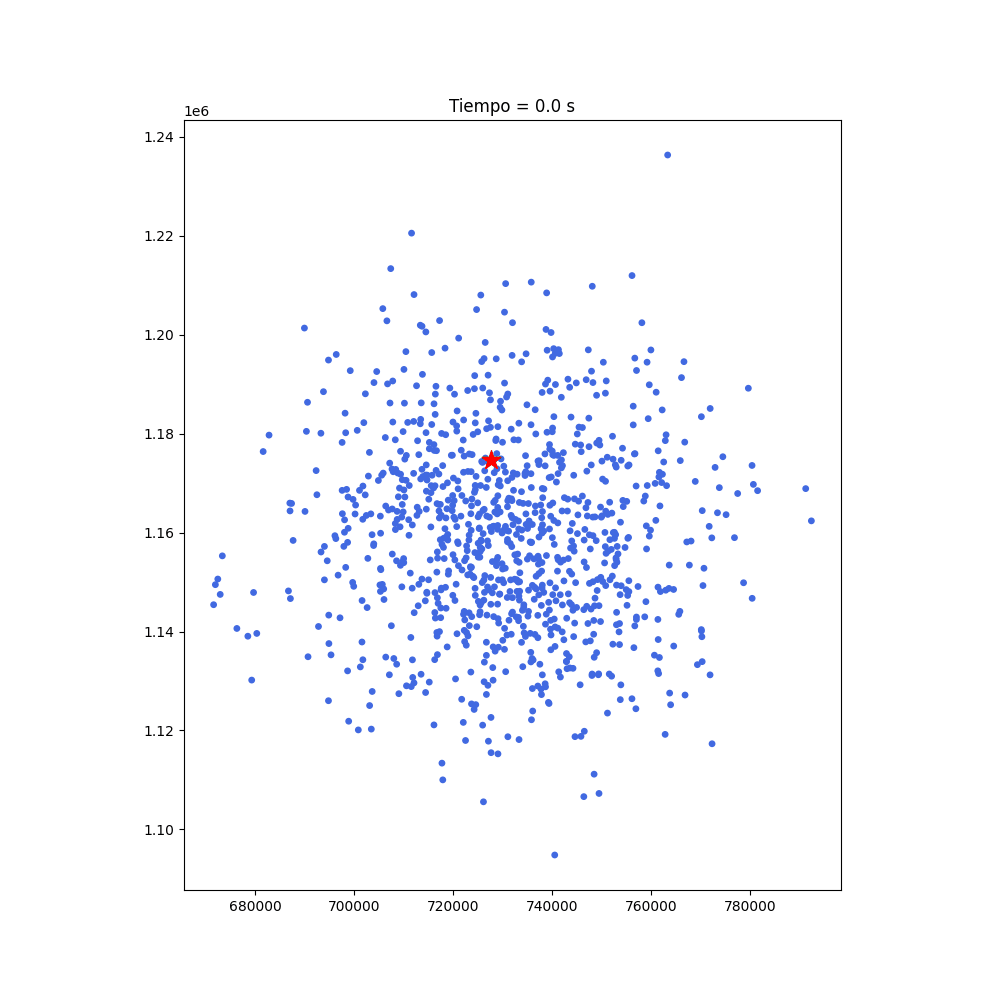
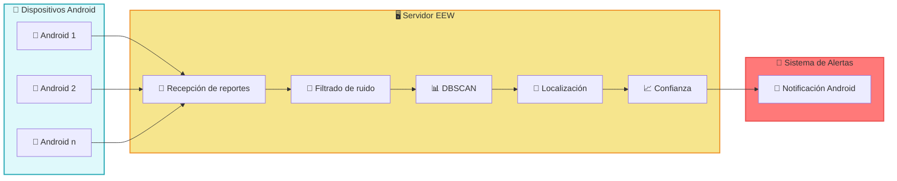
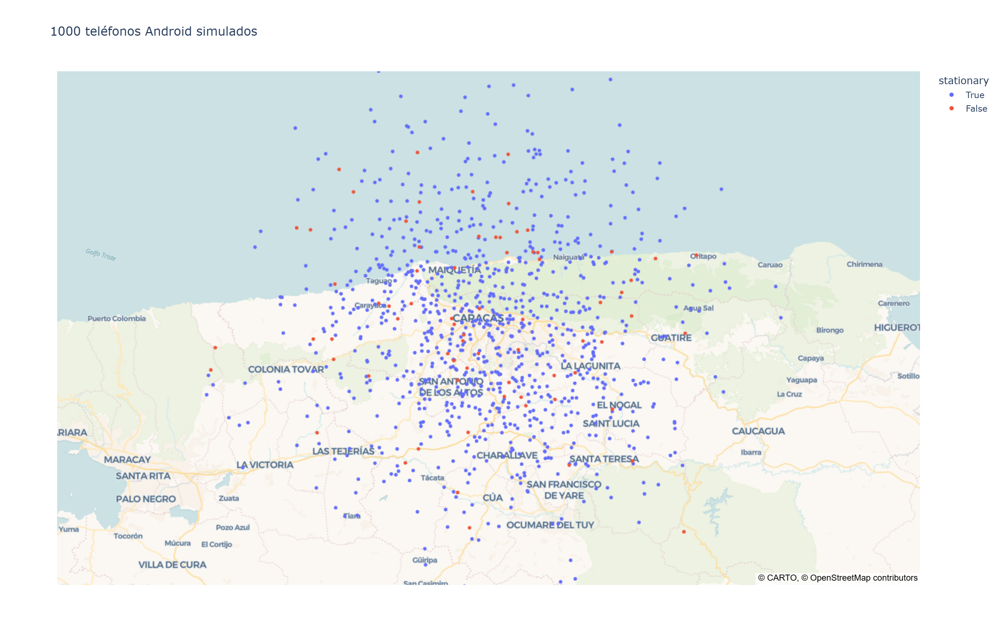
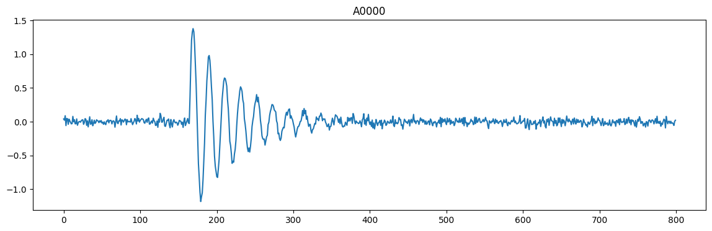
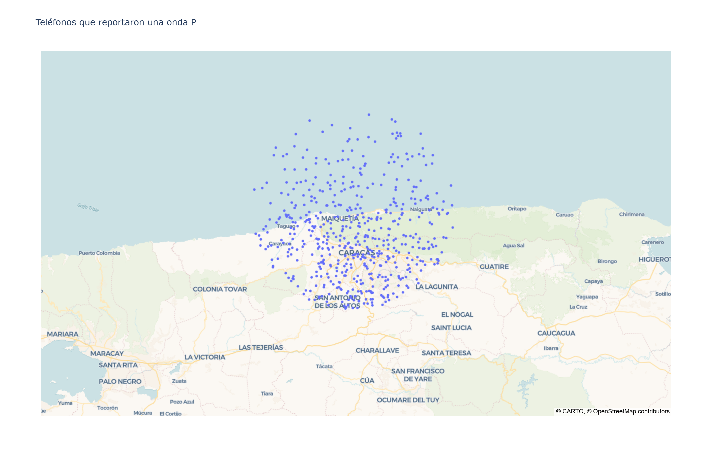
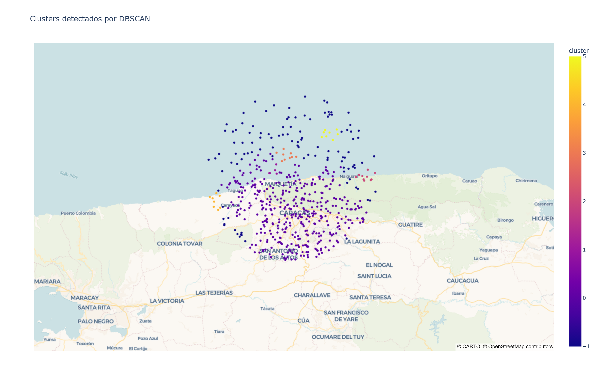
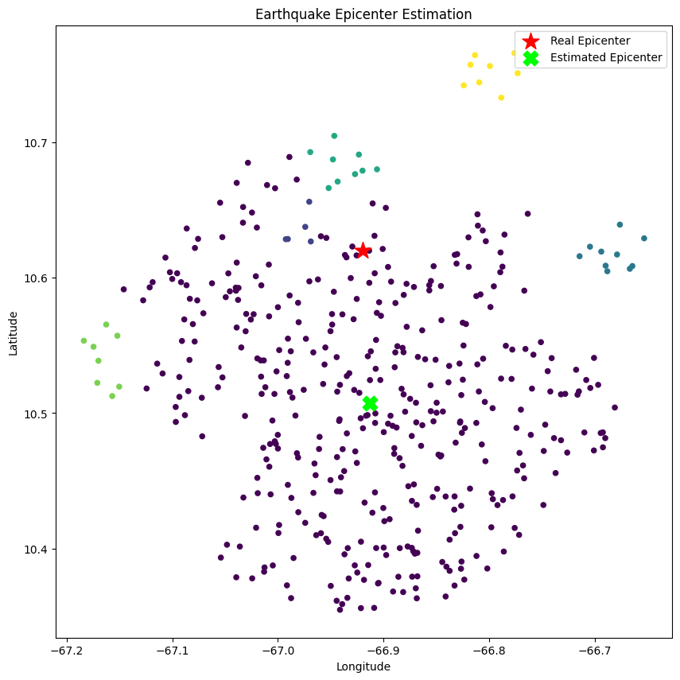
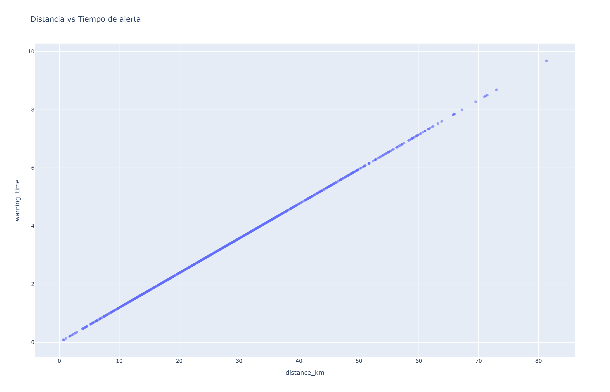

# 🌎 Simulador de Android Earthquake Alerts
### 📱 Simulación del Sistema de Alerta Temprana de Terremotos de Google con Python, Machine Learning y Computación Científica

> **Una simulación educativa inspirada en Android Earthquake Alerts que demuestra cómo millones de dispositivos Android pueden trabajar juntos como una red distribuida de sensores sísmicos para detectar terremotos y emitir alertas tempranas.**

<p align="center">



</p>

---

## 📖 Acerca del Proyecto

Cuando ocurre un gran terremoto, **cada segundo cuenta**.

El **24 de junio de 2026**, Venezuela vivió uno de los terremotos más fuertes de su historia moderna. Millones de usuarios de Android recibieron una alerta sísmica **segundos antes** de sentir el movimiento más intenso.

Ese acontecimiento inspiró este proyecto educativo.

Muchas personas se preguntaron:

> **"¿Google predijo el terremoto?"**

La respuesta es **no**.

**Android Earthquake Alerts** de Google **no predice terremotos**.

En su lugar, convierte millones de teléfonos Android en una enorme red distribuida de sensores sísmicos capaz de detectar las primeras ondas sísmicas y estimar la ubicación del terremoto en tiempo real.

Este notebook recrea ese concepto desde cero utilizando Python y diversas técnicas de computación científica.

---

# 🎯 Objetivos

Este proyecto tiene como objetivo demostrar, de forma visual y educativa, cómo funciona un sistema de Alerta Temprana de Terremotos (EEW, *Earthquake Early Warning*) inspirado en **Android Earthquake Alerts**.

La simulación incluye:

- 📱 Miles de teléfonos Android actuando como sensores sísmicos
- 🌊 Generación sintética de ondas P y ondas S
- 🤖 Detección local del evento sísmico
- 📡 Agregación anónima de reportes
- 📍 Agrupamiento espacial mediante DBSCAN
- 🧮 Estimación del epicentro utilizando Mínimos Cuadrados No Lineales
- 📊 Cálculo del nivel de confianza
- 🚨 Lógica para la generación de alertas tempranas
- 🎬 Animación en tiempo real de todo el proceso de detección

---

# 🏗 Arquitectura del sistema

---

# 🧠 Tecnologías utilizadas

| Tecnología | Propósito |
|------------|-----------|
| 🐍 Python | Lenguaje principal de programación |
| 📊 NumPy | Cálculos numéricos |
| 🧪 Pandas | Manipulación y análisis de datos |
| 🤖 Scikit-Learn | Agrupamiento espacial con DBSCAN |
| 📈 Matplotlib | Visualización científica |
| 🎞 Matplotlib Animation | Simulación y animación en tiempo real |
| 🌍 PyProj | Transformación de coordenadas geográficas |
| 📐 SciPy | Optimización mediante Mínimos Cuadrados |
| 🛰 Matemática Geoespacial | Estimación del epicentro |

---

# 📂 Estructura del proyecto

```text
Android-Earthquake-Alerts-Simulator/
│
├── Android_Earthquake_Alerts_Simulator.ipynb
│
├── images/
│   ├── earthquake.gif                ← Animación principal (Demo)
│   ├── sensor_network.png            ← Red de 1000 teléfonos Android
│   ├── p_wave_detection.png          ← Teléfonos que detectaron la onda P
│   ├── dbscan_clustering.png         ← Agrupamiento espacial mediante DBSCAN
│   ├── epicenter_estimation.png      ← Comparación entre el epicentro real y el estimado
│   ├── signal.png                    ← Señal simulada del acelerómetro
│   └── early_warning_time.png        ← Distancia vs. tiempo de alerta
│
├── README.md
├── requirements.txt
├── LICENSE
└── .gitignore
```

---

# ⚙️ Flujo de la simulación

Este notebook simula cada una de las etapas de un sistema moderno de alerta temprana de terremotos.

## 📱 1. Dispositivos android

Se genera una red de **1000 dispositivos Android** distribuidos en una región geográfica.

Cada teléfono cuenta con:

- Coordenadas GPS
- Acelerómetro
- Umbral de detección
- Tiempo de detección

---

## 🌊 2. Generación del terremoto

Se crea un terremoto sintético utilizando:

- Epicentro
- Magnitud
- Tiempo de origen
- Velocidad de la onda P
- Velocidad de la onda S

---

## 📡 3. Propagación de las ondas

La simulación modela:

- La propagación de la onda P
- La propagación de la onda S

Cada teléfono recibe las ondas en distintos momentos según su distancia al epicentro.

---

## 🤖 4. Detección local

Cada dispositivo Android detecta de forma independiente la llegada de la onda P.

Solo los teléfonos que permanecen inmóviles son considerados sensores válidos.

Cuando se produce una detección, el teléfono envía un reporte anónimo que contiene:

- Marca de tiempo de la detección
- Ubicación aproximada
- Firma del movimiento detectado

---

## 📊 5. Agrupamiento espacial

El servidor recibe miles de reportes.

En lugar de confiar en una única detección, busca agrupaciones espaciales utilizando:

> **DBSCAN**

Esto reduce significativamente los falsos positivos.

---

## 📍 6. Estimación del epicentro

Cuando existe un número suficiente de reportes, el sistema estima la ubicación del terremoto mediante:

- Mínimos Cuadrados No Lineales
- Tiempos de llegada de las ondas
- Modelo de propagación sísmica

Conforme llegan nuevos reportes, el epicentro estimado converge progresivamente hacia la ubicación real.

---

## 📈 7. Cálculo del Nivel de Confianza

En lugar de emitir una alerta inmediatamente, el simulador calcula un nivel de confianza considerando:

- Cantidad de dispositivos que reportan
- Consistencia espacial
- Consistencia temporal
- Error residual del modelo

Solo los eventos con alta confianza generan una alerta.

---

## 🚨 8. Generación de la alerta

Cuando el nivel de confianza supera el umbral establecido:

```text
🚨 ALERTA DE TERREMOTO

Magnitud: 7.4

Confianza: 96%

Epicentro estimado:
10.47°N
66.90°W
```

---

---

# 🖼️ Visualizaciones de la simulación

A continuación se muestran algunas de las principales visualizaciones generadas durante la ejecución del notebook.

---

## 📱 Red de 1000 teléfonos android

Representación geográfica de la red distribuida de dispositivos Android que participan como sensores sísmicos.



---

## 🌊 Señal simulada del acelerómetro

Señal sintética generada por el acelerómetro de un dispositivo Android durante la llegada de las ondas sísmicas.



---

## 📡 Teléfonos que detectaron la onda P

Dispositivos que detectaron la llegada de la onda P y enviaron un reporte al servidor de alerta temprana.



---

## 🤖 Agrupamiento espacial mediante DBSCAN

Visualización del algoritmo DBSCAN agrupando los reportes recibidos para identificar un evento sísmico real y reducir falsos positivos.



---

## 📍 Comparación entre el epicentro real y el estimado

Comparación entre la ubicación real del terremoto y el epicentro estimado a partir de los reportes de los dispositivos Android.



---

## 🚨 Distancia vs. tiempo de alerta

Gráfica que muestra cómo el tiempo disponible para emitir una alerta disminuye conforme aumenta la distancia al epicentro.



---

# 🎬 Animación

El notebook incluye una simulación completamente animada que muestra:

✅ Origen del terremoto

✅ Expansión de la onda P

✅ Expansión de la onda S

✅ Cambio de estado de los teléfonos Android

✅ Recepción de reportes

✅ Estimación del epicentro

✅ Evolución del nivel de confianza

✅ Emisión final de la alerta para Android

---

# 📊 Conceptos científicos

Este proyecto introduce diversos conceptos ampliamente utilizados en:

- 🌍 Sismología
- 🤖 Inteligencia Artificial
- 🛰 Computación Geoespacial
- 📡 Sistemas Distribuidos
- 📈 Optimización
- 📊 Ciencia de Datos

Entre ellos:

- Distancia de Haversine
- Transformaciones de Coordenadas
- UTM
- Coordenadas ENU
- DBSCAN
- Mínimos Cuadrados
- Estimación de Confianza
- Visualización Científica
- Sistemas Distribuidos de Detección

---

# 📸 Ejemplo de Salida

```text
Terremoto detectado

Teléfonos reportando:
842

Epicentro estimado:
10.48°N
66.92°W

Error de localización:
2.13 km

Confianza:
97.4%

🚨 ALERTA ENVIADA
```

---

# 🚀 Mejoras futuras

Algunas ideas para ampliar este simulador:

- 🌍 Estimación tridimensional del hipocentro
- 📡 Filtrado mediante Kalman
- 📈 Localización Bayesiana
- 🛰 Integración con estaciones sísmicas reales
- 🌊 Simulación de formas de onda reales
- ☁️ Servidor distribuido en la nube
- 🤖 Clasificadores basados en Deep Learning
- 📲 Simulación de clientes Android
- 🌎 Panel interactivo en la web

---

# ⚠️ Aviso

Este proyecto es una **simulación educativa** inspirada en la información pública disponible sobre **Android Earthquake Alerts**.

**No corresponde a la implementación propietaria de Google** y **no debe utilizarse como un sistema operativo de alerta sísmica**.

Su propósito es explicar los conceptos científicos y de ingeniería que hacen posible los sistemas modernos de Alerta Temprana de Terremotos (EEW).

---

# 💙 ¿Por qué es importante este proyecto?

Actualmente los terremotos **no pueden predecirse**.

Sin embargo, **sí pueden detectarse apenas unos segundos después de comenzar**.

Esos pocos segundos pueden parecer insignificantes, pero pueden ser suficientes para:

- 🏃 Ponerse a salvo
- 🚆 Detener trenes
- 🏥 Proteger hospitales
- ⚡ Desactivar infraestructura crítica
- ❤️ Salvar vidas

La tecnología no puede detener un terremoto.

Pero sí puede ayudar a las personas a prepararse.

Y, en ocasiones...

unos pocos segundos hacen toda la diferencia.

---

# 🙏 Agradecimientos

Inspirado en:

- 📱 Android Earthquake Alerts
- 🌍 Google Research
- 🛰 USGS
- 🌐 ShakeAlert®
- 🌎 Sistemas de Alerta Temprana de Terremotos
- 💙 La resiliencia del pueblo venezolano

---

# ⭐ ¿Te resultó útil este proyecto?

Considera darle una ⭐ en GitHub.

Ayudará a que más personas descubran el proyecto y apoyará las iniciativas educativas de código abierto.

---

## ✨ Autora

**Orli Dun**

💜 Desarrolladora Full Stack  
🌎 Creadora de Contenido Tecnológico  
🤖 Entusiasta de la Inteligencia Artificial  
💬 Líder de Comunidades

> **Code with heart — Create with soul.** 💜
